# Welcome to <!-- fit -->
## Workshop Arduino Basics <!-- fit -->
### door VIVES - Industriele Wetenschappen en Technologie

---

# Waar ben je?


Campus Brugge Xaverianen

---

# Wie zijn wij?

- De bachelor opleiding elektronica - ICT
- Wij leren studenten werken met
  - Elektronica, sensoren, microcontrollers, ....
  - Internet of Things
  - Software en Web Development
  - Netwerken en infrastructuur
  - Artificiële Intelligentie


---

# Doel van vandaag

- Vandaag zijn we hier om iets bij te leren over
  - Arduino
  - Programmeren
  - Sensoren en hardware

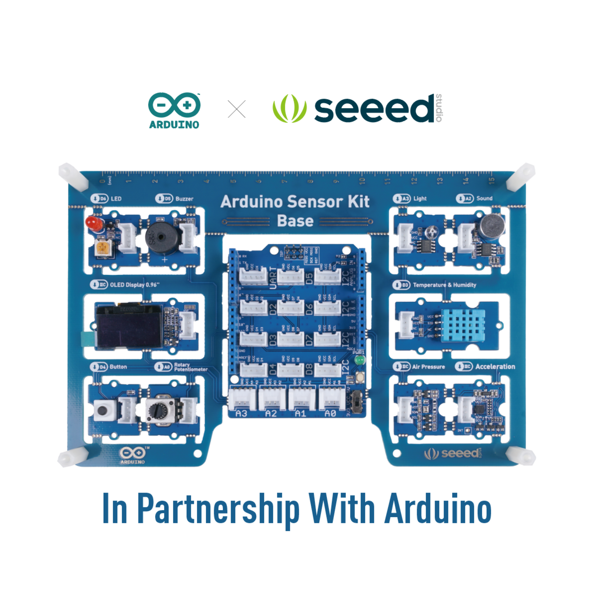

---

# Hoe pakken we dit aan?

- Kleine stukjes theorie
- Met kleine oefeningen
- Zelf dingen doen
- Experimenteren

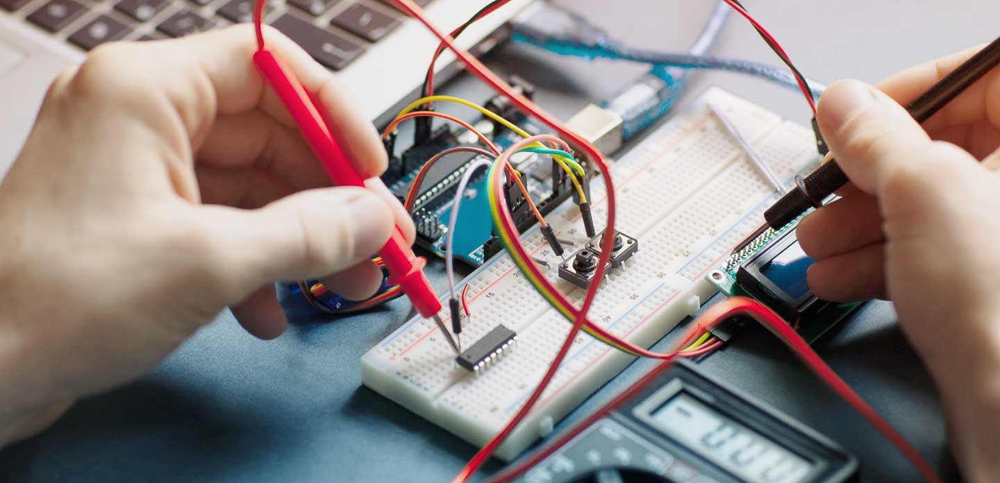

---


---

# Wat is Arduino?

- Arduino is een open-source hardware en software bedrijf
  - Ontwikkelt microcontroller bordjes
  - Voorziet software voor het programmeren: Arduino IDE
  - Heeft een website met documentatie, projecten, ...
    - [https://www.arduino.cc/](https://www.arduino.cc/)
  - Origineel bedoelt voor studenten van een Italiaanse school

---

## Het hart van de Arduino

- Is een microcontroller
  - Een kleine "computer" als 1 chip
  - Bevat een CPU, wat geheugen en I/O
- Dit voert instructies uit
- Koppelt aan hardware (sensoren en dergelijke)
- Doet uit zichzelf niets ! Moet geprogrammeerd worden.

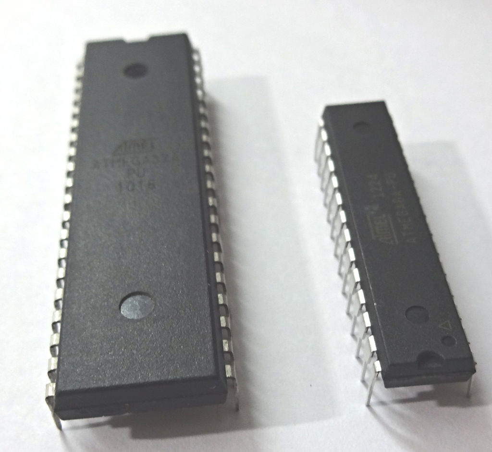

---

# Wat kunnen we hiermee allemaal? <!-- fit -->

---

## Een robot bouwen


---

## Een plotter

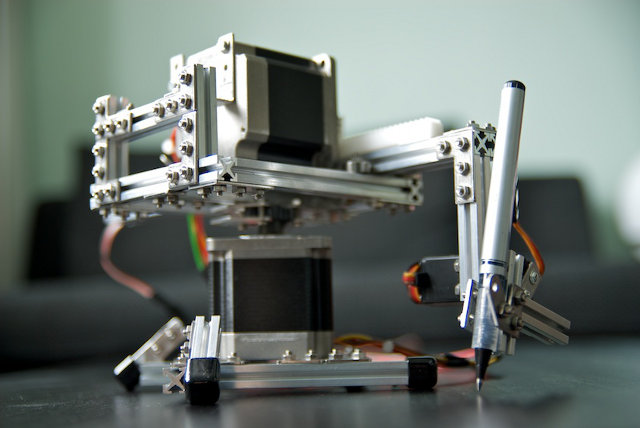

---

## Een game controller

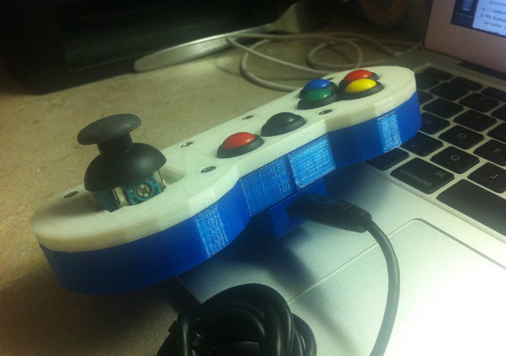

---

## LED Toepassingen

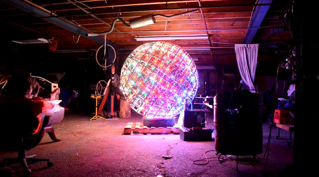
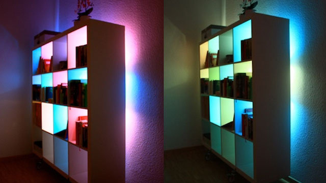

---

## Een automatische cocktail bar

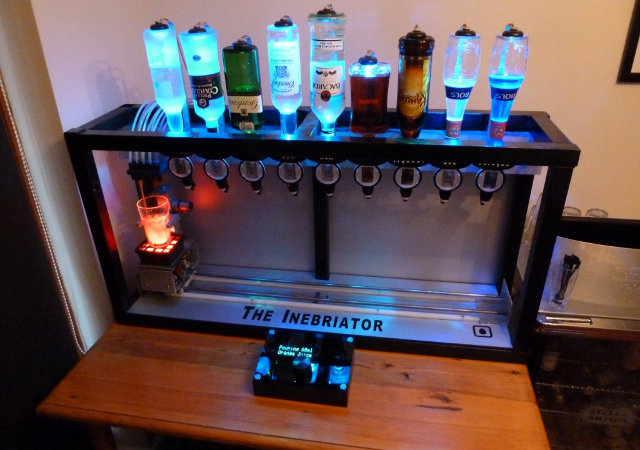

---

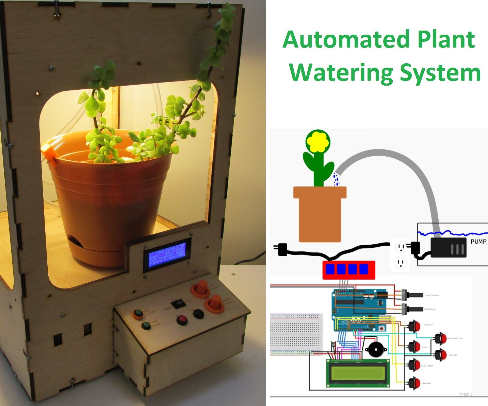

---

## Een DIY zuurstof respirator

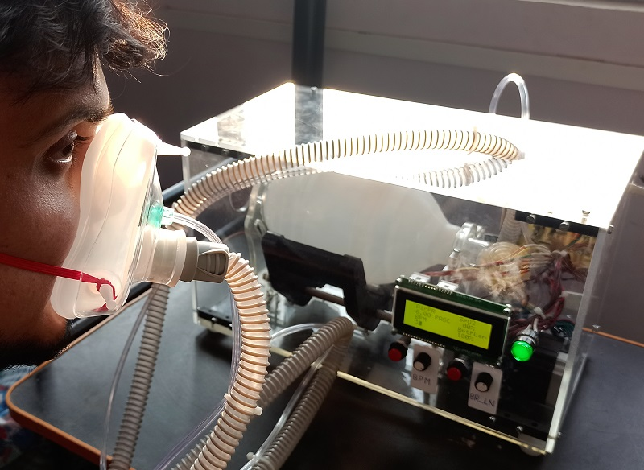

---

## De mogelijkheden zijn eindeloos

- Je kan het eigenlijk zo zot niet bedenken
- Heel toegankelijk voor jongeren
- Super veel informatie verkrijgbaar
  - [https://docs.arduino.cc/](https://docs.arduino.cc/)
  - [https://maker.pro/arduino/projects](https://maker.pro/arduino/projects)
- Niet te duur
- Wordt zelfs in bedrijven gebruikt om prototypes te bouwen

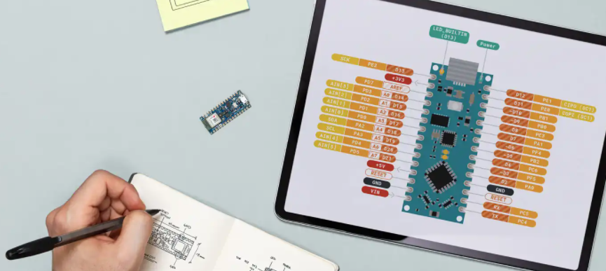

---

# Welke Arduino's bestaan er allemaal

- Eigenlijk teveel om op te noemen
- Je hebt officiële Arduino boards
- Je hebt Arduino compatibele boards

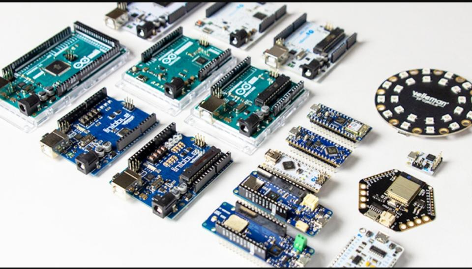

*Kijk maar eens op [https://store.arduino.cc/collections/boards](https://store.arduino.cc/collections/boards).*

---

# Aan de slag - Wat heb je nodig

- Een Arduino bordje
  - Eventueel een starter kit
  - Nu geruik je de [Arduino Uno Rev3 SMD](https://store.arduino.cc/collections/boards/products/arduino-uno-rev3-smd)
- Een idee
- Een computer
  - Arduino IDE
- Wat C++ kennis

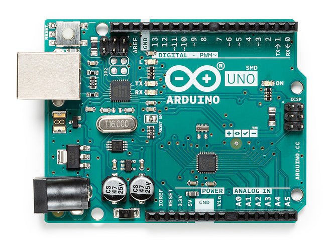

*De helft hiervan is gratis of heb je al!*

---


---

# Wat is Programmeren

- Programmeren is instructies geven aan een computer
- Die verstaat echter onze taal niet
  - Verstaat enkel een obscure taal van 1'en en 0'en

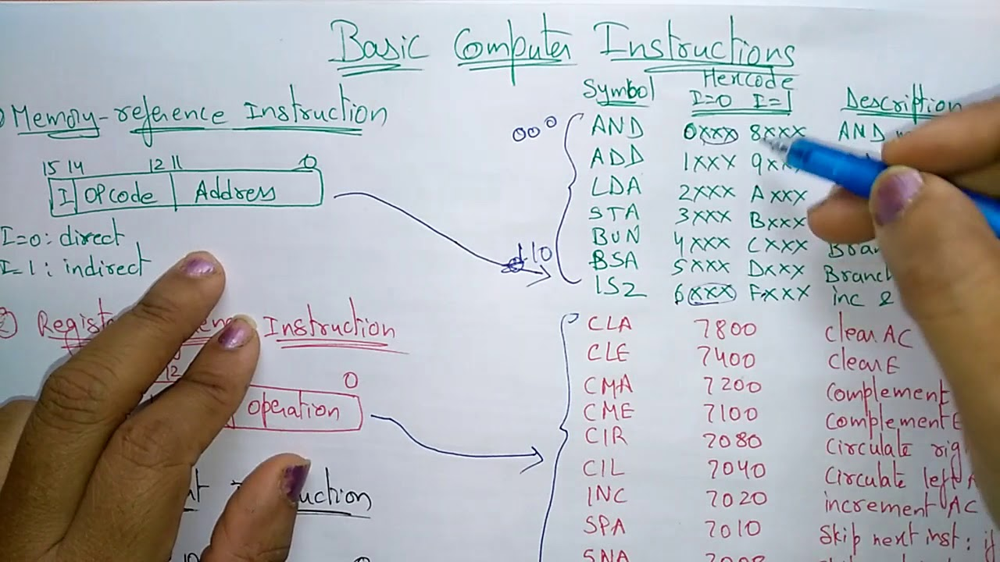

---

## Programmeertaal

- Dit is echter veel te complex (low-level) om mee te werken
- Vandaar dat we een "hogere" programmeertaal gebruiken


---

## Compileren

- Wij schrijven dan een programma in die programmeertaal
- Dit wordt dan **vertaald in computer instructies**
  - Dit noemen we compileren

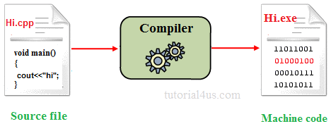

---

## Binary

- Het resultaat van het compilatie-proces is een **binary**
  - Die moeten we wegschrijven naar de microcontroller
    - Dit noemen we **flashen**

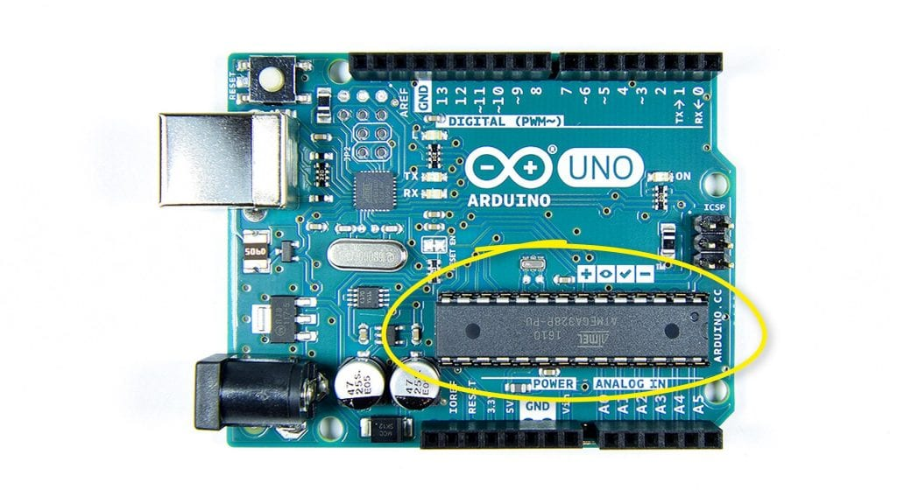

---

## Programmeren met Arduino

- Arduino's programmeren doen we met C++
  - ✅ Heel populair voor microcontrollers
  - ✅ Krachtig en snel
  - ❌ Niet de gemakkelijkste taal om mee te starten
  - ✅ Gratis [IDE voor Arduino](https://www.arduino.cc/en/software)

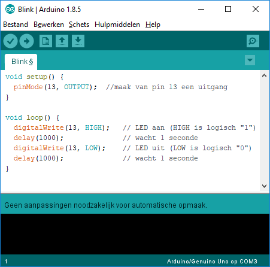

---


---

# Starten met "Hello World"

- In de wereld van programmeren starten we altijd met "Hello World"
  - Simpele applicatie die toch iets doet
  - Toont aan dat alles werkt


---

## Hello World - Openen Sketch

- Sketch = programma bij Arduino
- Ga naar `Bestand => Openen` en selecteer `01-hello-world`


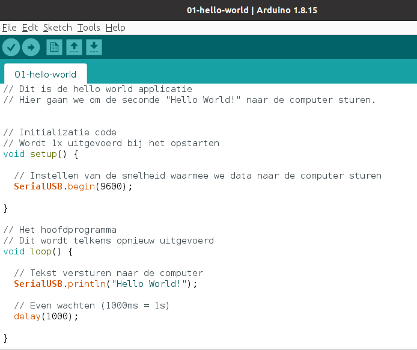

---

## Hello World - Bord kiezen

- Bij 1ste keer programmeren moeten we het correcte bord kiezen
- Selecteer `Arduino Uno` via `Hulpmiddelen => Board`
- Selecteer `/dev/ttyACM0 (Arduino Uno)` via `Hulpmiddelen => Poort`

---

## Hello World - Compileren en Flashen

- Het programma dient eerst te worden gecompileerd
- Vervolgens flashen we de computer instructies naar de microcontroller
- Druk op de pijl naar rechts ➡️
  - Dit compileert zowel als het flashen van het device

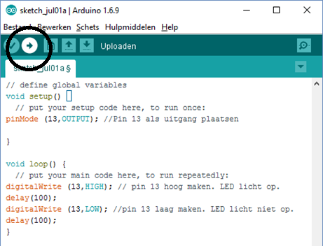

---

## Hello World - Het resultaat

- Het resultaat kunnen we zien in de seriële monitor
- Klik op `Hulpmiddelen => Seriële monitor` of op het vergrootglas 🔎 rechts


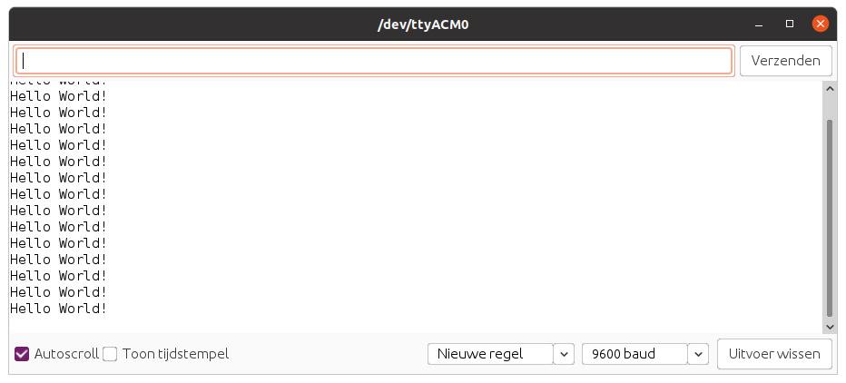

---

## Hello World - Analyse

- `setup()`:
  - Wordt 1x uitgevoerd wanneer de microcontroller start
  - Hier gaan we bv. hardware initialiseren
    - Zoals de "baudrate" (snelheid) zetten van de seriële poort
      - `Serial.begin(9600);`
    - Dit is de connectie met de computer

---

## Hello World - Analyse

- `loop()`:
  - Wordt telkens opnieuw uitgevoerd
    - Heel snel na elkaar
    - Vandaar dat we een vertraging moeten plaatsen
    - `delay(1000)`, betekent `1000ms` of `1s` wachten
  - We kunnen ook tekst sturen naar de computer
    - `Serial.println("Hello World");`
    - Merk op dat we tekst tussen dubbele aanhalingstekens plaatsen `"..."`

---

## Hello World - Oefening

- Probeer de hello world sketch aan te passen zodat:
  - Het jouw naam toont: `Hello World! Ik ben Nico`
  - Er 5 seconden wordt gewacht tussen elk bericht in plaats van 1 seconde
  - Probeer volgende tekst op een nieuwe lijn toe te voegen
    - `Ik studeer land- en tuinbouw`

---

## Hello World - Oplossing

```cpp
void loop() {

  // Tekst versturen naar de computer
  Serial.println("Hello World! Ik ben Nico");
  Serial.println("Ik studeer land- en tuinbouw");

  // Even wachten (5000ms = 5s)
  delay(5000);
}
```

---


---

# Variabelen

- Een variabel is een symbolische naam voor een geheugen locatie in een computer
- Een variabel kan een getal, tekst, karakter, ... bevatten
- Een variabel kan van waarde veranderen
- We kunnen er ook bewerkingen op uitvoeren


---

## Variabelen - Declareren

- Variabelen moeten we eerst declareren = kenbaar maken
- We geven de variabel een **naam**
- Geven ook aan welk **type** het is
- En we kunnen ook een 1ste **waarde** meegeven

---

## Variabelen - Declareren

- Hoe?
  - `type naam = waarde;`

- Een paar voorbeelden:

```cpp
// int = een getal (kan ook negatief zijn)
int leeftijd = 34;

// String = tekst
String naam = "Nico";

// double = komma-getal
double pi = 3.14;
```

---

## Variabelen - Declareren

- Types: `int`, `double`, `String` (er zijn er nog andere)
- Kiezen van de naam
  - Geen spaties of speciale tekens
  - Beschrijvende en duidelijke naam

---

## Variabelen - Printen

- De waarde van een variabel kunnen we tonen door deze uit te printen

```cpp
// Eerst printen we een beetje tekst
Serial.print("De variabel naam: ");

// Dan kunnen we de waarde van de variabel printen
Serial.println(naam);
```

---

## Variabelen - Veranderen van waarde

- De waarde van een variabel kunnen we ook veranderen met `=`

```cpp
// Veranderen van de waarde van een variabel
naam = "Chuck Norris";

// Of van een getal variabel
leeftijd = 35;
```

- Merk op dat we enkel de variabel naam links plaatsen (geen type)
  - De variabel bestaat namelijk al
- Als je deze nu opnieuw print zal je de nieuwe waarde zien

---

## Variabelen - Demo Sketch

- Ga naar `Bestand => Openen` en selecteer `02-variabelen`
- Bovenaan zie je een aantal variabelen gedeclareerd
- In `loop()` printen we de waarde van de variabelen

---

## Variabelen - Oefening

- Verander de waarde van de variabel `naam` door je eigen naam
  - Doe dit bij het maken van de variabel (helemaal bovenaan)
- Maak `pi` nauwkeuriger door er `3.1415` van te maken
  - Doe dit in `setup()`
- Verander `leeftijd` naar je eigen leeftijd
  - Doe dit in `loop()`

*Kan je verklaren wat het verschil is tussen deze 3 manieren?*

---

## Variabelen - Oplossing

- `naam` veranderen bovenaan

```cpp
// String = tekst
String naam = "Chuck Norris";
```

*Hier wordt de 1ste waarde aangepast op het moment dat we de variabel maken*

---

## Variabelen - Oplossing

- `pi` veranderen in `setup()`

```cpp
void setup() {

  // Instellen van de snelheid waarmee we data naar de computer sturen
  Serial.begin(9600);

  // pi aanpassen naar nauwkeurigere waarde
  pi = 3.1415;

}
```

*`pi` is bij declaratie `3.14`, dan wordt `setup()` uitgevoerd en daar passen we de waarde aan naar `3.1415`*

---

## Variabelen - Oplossing

- `leeftijd` veranderen in `loop()`

```cpp
void loop() {

  leeftijd = 35;

  // ...
```

*`leeftijd` is bij declaratie `34`. Vervolgens gaan we elke keer dat `loop()` wordt uitgevoerd, de `leeftijd` aanpassen naar `35`.*

---

## Variabelen - Wiskundige Bewerkingen

- Variabelen kunnen ook worden gebruikt in bewerkingen
- Gelijklopend met de wiskundige bewerkingen
- Voorbeelden (`a`, `b`, `c`, ... zijn `int` variabelen)

```cpp
a = a + 15;
b = a - c;
c = 45 / 9;
d = (10 * 10) + 5;
```

*Merk op dat je ook haakjes mag gebruiken*

---

## Variabelen - Wiskundige Bewerkingen - Oefening

- Zorg er voor dat de variabel `teller` elke iteratie van `loop()` met `1` wordt verhoogt.


---

## Variabelen - Wiskundige Bewerkingen - Oplossing

- Je kan hiervoor de bewerking `teller = teller + 1` gebruiken

```cpp
void loop() {

  // ....

  // De teller variabel verhogen
  teller = teller + 1;

  // Een teller als variabel
  Serial.print("De variabel teller heeft de waarde ");
  Serial.println(teller);

  // Even wachten (1000ms = 1s)
  delay(1000);
}
```

---

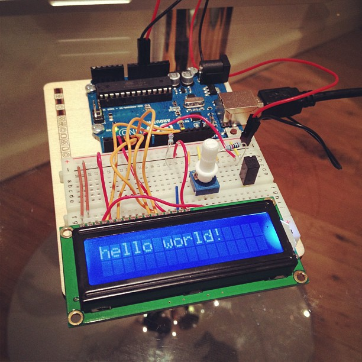

---

# Hardware

- Het leuke aan microcontrollers en dergelijke is dat we er hardware kunnen aan koppelen
  - Onder de vorm van shields
  - Of aparte sensoren en actuatoren

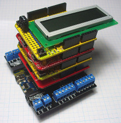

---

## Hardware - Sensoren en Actuatoren

- Voorbeelden
  - Een lichtje - aka LED
  - Een knop - aka button
  - Een temperatuur sensor
  - Een vochtsensor
  - Een geluid alarm - aka buzzer
  - Een servo motor
  - ...

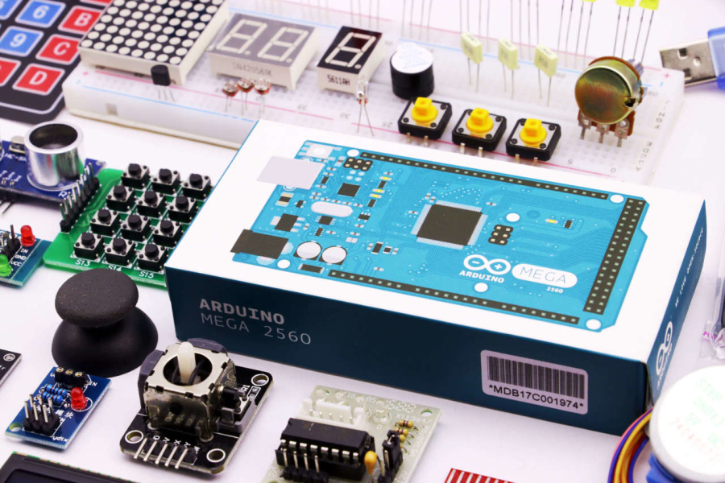

---

## Hardware - Koppelen

- Komt wel wat bij kijken
  - Correcte aansluiting
  - Spanningsniveau (5V, 3V3, ...)
  - Communicatie protocol (hoe ermee praten)
  - Libraries (software)
  - ...


---

## Hardware - Koppelen

- Arduino helpt hier heel veel
  - Veel informatie online / boeken
  - Starter kits
  - Click shields

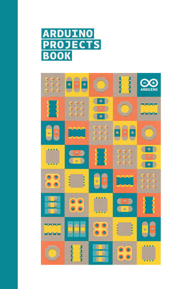

---

## Hardware - Grove

- Gestandaardiseerd prototype systeem
- Makkelijk connecteerbaar maken
- Voorbeelden van code online
- Bestaat uit
  - Adapterbord
  - Module (sensoren - actuatoren)
  - 4-pins connector

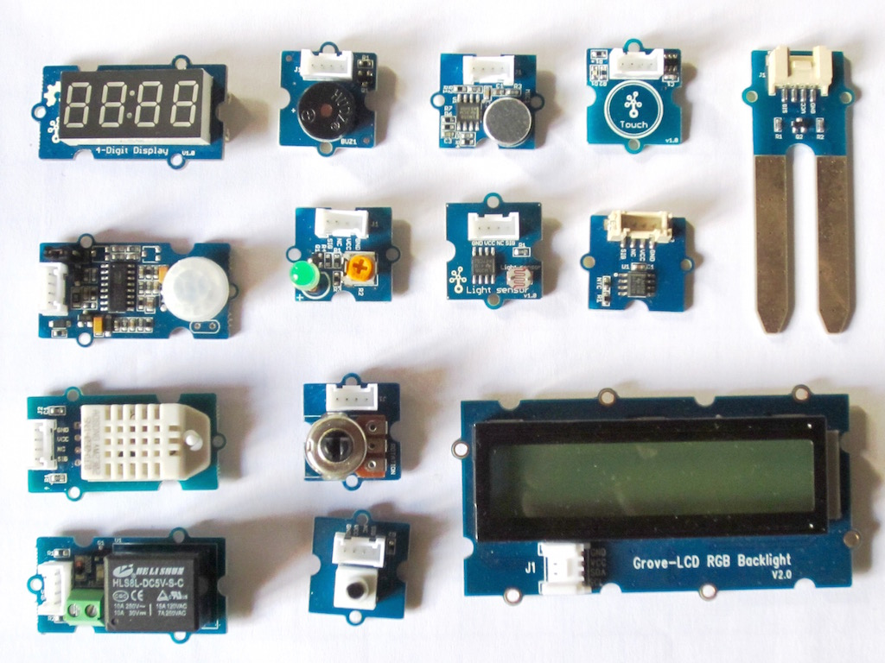

[https://www.seeedstudio.com/](https://www.seeedstudio.com/)

---

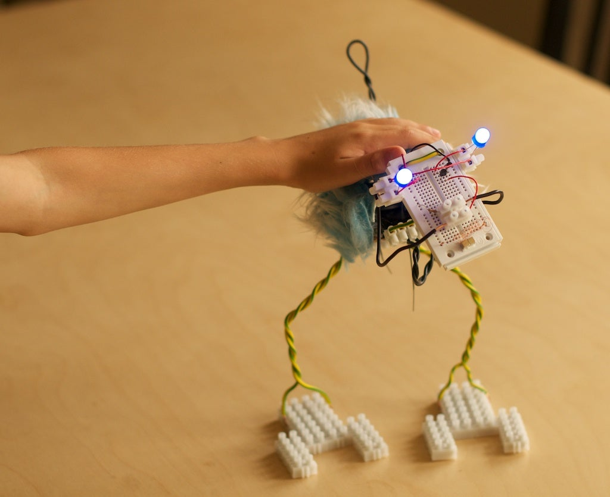

---

## Hardware - Blinky LED

- We maken de "Hello World" van microcontrollers
- Een lichtje dat aan en uit gaat - aka "Blinky"

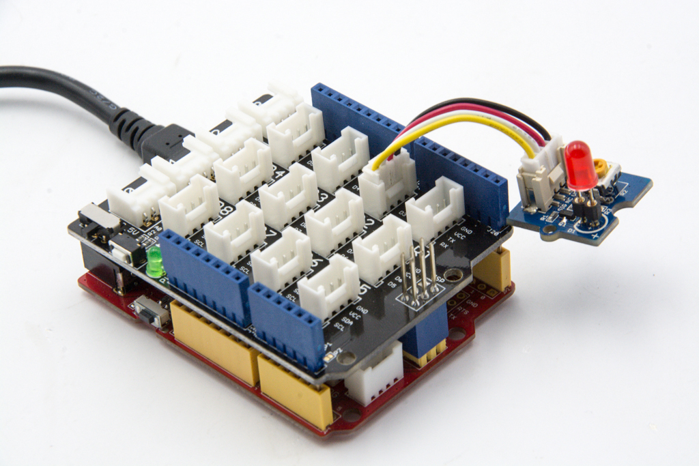

---

### Hardware - Blinky - Benodigdheden

- Arduino
- Grove Shield
- LED Module
- Een gekleurde LED


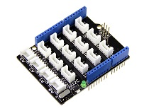
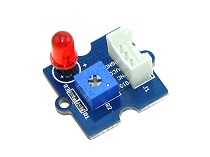

---

### Hardware - Blinky - Aansluiten

- Klik het shield voorzichtig op de Arduino
- Sluit de kabel aan op de `D2` connector
  - `D` = digitaal
- Zet de schakelaar op `5V`
- Sluit de LED module aan
- Stop een LED in de module
  - Let op de vorm

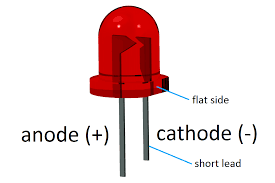


---

### Hardware - Blinky - Demo Sketch

- Ga naar `Bestand => Openen` en selecteer `03-blinky`
- Druk op de pijl naar rechts ➡️ om te compileren en flashen

*Meer informatie vind je op [https://wiki.seeedstudio.com/Grove-Red_LED/](https://wiki.seeedstudio.com/Grove-Red_LED/)*

---

### Hardware - Blinky - Analyse

- `pinMode(2, OUTPUT);`
  - Hiermee stellen we pin `2` in als een digitale uitgang
    - Digitaal = `1` of `0`
      - `1` = `5V`
      - `0` = `0V`
    - Met een uitgang kunnen we iets aansturen
  - 1x dus doen we dit in `setup()`

---

### Hardware - Blinky - Analyse

- `digitalWrite(2, HIGH);`
  - Hiermee maken we pin `2` hoog
    - hoog = `1` of dus `5V`
- `digitalWrite(2, LOW);`
  - Hiermee maken we pin `2` laag
    - laag = `0` of dus `0V`

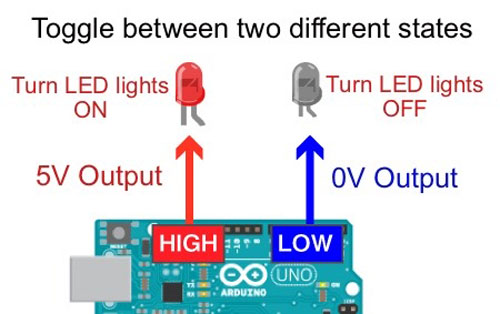

---

### Hardware - Blinky - Oefening

- Kan je de LED sneller aan en uit laten gaan?
- Kan je de LED 1 seconde aan laten en 2 seconden uit?

---

### Hardware - Blinky - Oplossing

- Sneller aan / uit
  - Dit kan door beide delays te verkleinen

```cpp
void loop() {

  Serial.println("We zetten de LED aan");
  digitalWrite(2, HIGH);    // Uitgang aanzetten (HOOG = 5V)
  delay(200);    // Even wachten (200ms = 0.2s)

  Serial.println("We zetten de LED uit");
  digitalWrite(2, LOW);    // Uitgang uitzetten (LAAG = 0V)
  delay(200);    // Even wachten (200ms = 0.2s)

}
```

---

### Hardware - Blinky - Oplossing

- 1 seconde aan / 2 seconden uit
  - Dit kan door beide delays anders te kiezen

```cpp
void loop() {

  Serial.println("We zetten de LED aan");
  digitalWrite(2, HIGH);    // Uitgang aanzetten (HOOG = 5V)
  delay(1000);    // Even wachten (1000ms = 1s)

  Serial.println("We zetten de LED uit");
  digitalWrite(2, LOW);    // Uitgang uitzetten (LAAG = 0V)
  delay(2000);    // Even wachten (2000ms = 2s)

}
```

---


---

## Hardware - Button

- De simpelste sensor die we kunnen bedenken is een drukknop
- Koppelen we aan digitale **ingang**
  - Indrukken = HOOG = `1` = `5V`
  - Loslaten = LAAG = `0` = `0V`

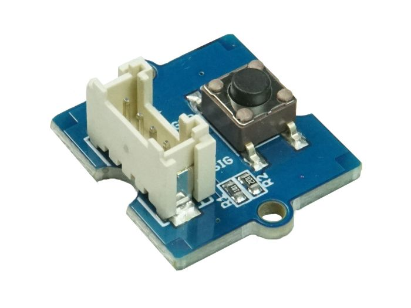

---

### Hardware - Button - Aansluiten

- Klik het shield voorzichtig op de Arduino
- Sluit de kabel aan op de `D3` connector
  - `D` = digitaal
- Zet de schakelaar op `5V`
- Sluit de BUTTON module aan

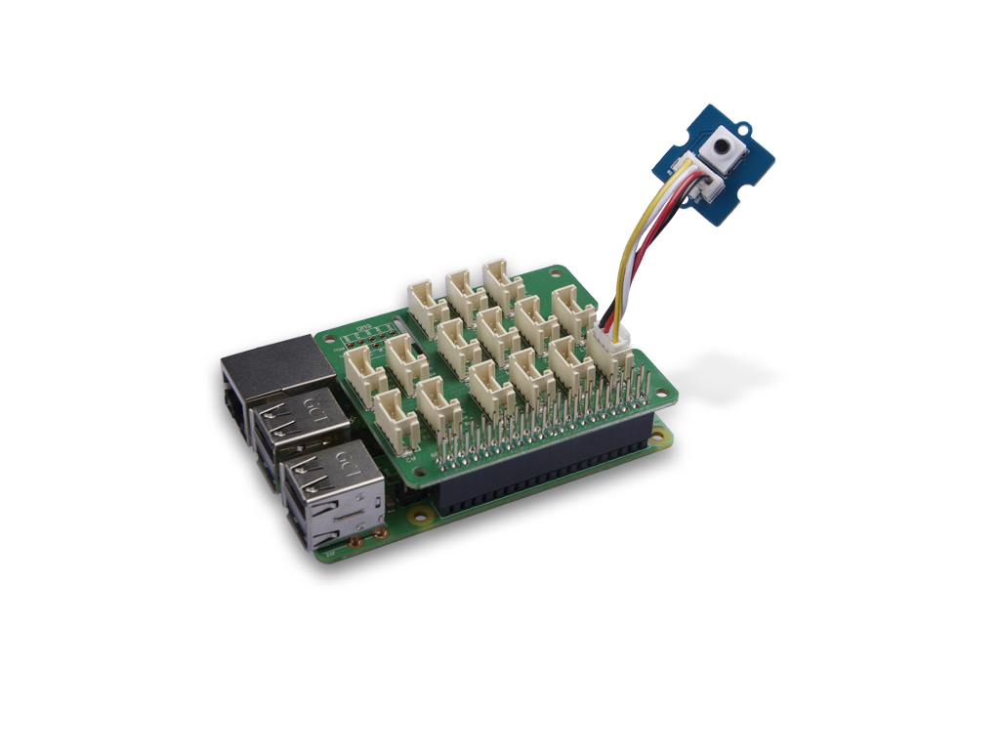

---

### Hardware - Button - Demo Sketch

- Ga naar `Bestand => Openen` en selecteer `04-button`
- Druk op de pijl naar rechts ➡️ om te compileren en flashen

*Meer informatie vind je op [https://wiki.seeedstudio.com/Grove-Button/](https://wiki.seeedstudio.com/Grove-Button/)*

---

### Hardware - Button - Analyse

- `pinMode(3, INPUT);`
  - Hiermee stellen we pin `3` in als een digitale ingang
    - Digitaal = `1` of `0`
      - `1` = `5V` = knop ingedrukt
      - `0` = `0V` = knop los gelaten
    - Met een ingang kunnen we iets inlezen
  - 1x dus doen we dit in `setup()`

---

### Hardware - Button - Analyse

- `int knop = digitalRead(3);`
  - Hiermee kunnen we de staat van een ingang binnenlezen
  - Het resultaat slaan we op in de variabel `knop`


---

### Hardware - Button - Oefening

- Kan je nu de LED aansturen met de knop?

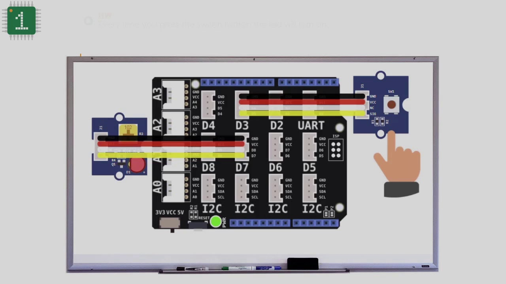

---

### Hardware - Button - Oplossing

- Dit kan inderdaad. We kunnen de waarde in de variabel `knop` naar `D2` schrijven:

- In `setup()` moeten we `D2` als uitgang zetten:

```cpp
// Configureer D2 als een digitale uitgang
pinMode(2, OUTPUT);

// Configureer D3 als een digitale ingang
pinMode(3, INPUT);
```

---

### Hardware - Button - Oplossing

- In `loop()` kunnen we `D2` (de LED) aansturen met de waarde van `D3` (de knop)
- Dus in plaats van `LOW` of `HIGH` te schrijven, sturen we de waarde van `knop`:

```cpp
void loop() {

  int knop = digitalRead(3);
  Serial.print("De toestand van de knop is: ");
  Serial.println(knop);

  // Zet de uitgang gelijk aan de stand van de knop
  digitalWrite(2, knop);

  delay(1000);    // Even wachten (1000ms = 1s)

}
```

---

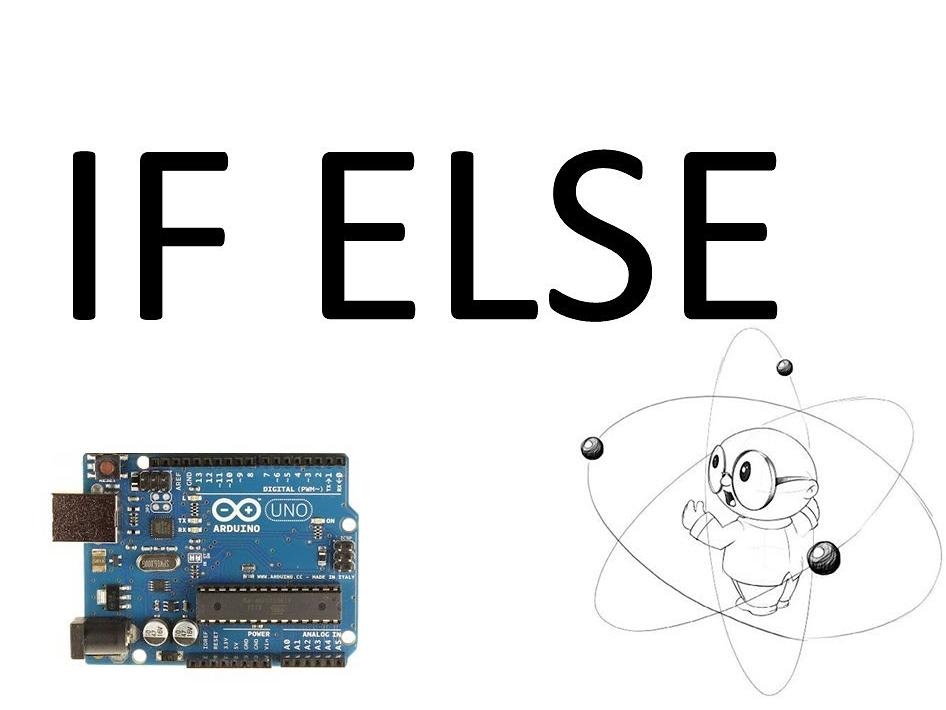

---

# Beslissingen maken in code

- Beslissingen kunnen we in code maken aan de hand van `if-else` structuren
- `if`: als een **conditie waar** is dan doen we iets
- `else`: anders doen we eventueel iets anders

TODO: Figuur

---

## Beslissingen - De conditie

- De conditie bestaat meestal uit 1 of meerdere vergelijkingen
- Hierbij kunnen we een aantal operatoren van de wiskunde gebruiken:
  - `==`: gelijk aan
  - `!=`: verschillend van
  - `>`: groter dan
  - `>=`: groter dan of gelijk aan
  - `<`: kleiner dan
  - `<=`: kleiner dan of gelijk aan

---

## Beslissingen - De conditie - Voorbeeld

- Een voorbeeld van een beslissing
  - Toegepast op de `04-button` sketch

```cpp
if (knop == HIGH) {
  Serial.println("De knop is ingedrukt");
} else {
  Serial.println("De knop is niet ingedrukt");
}
```

*Probeer dit maar eens uit ...*

---

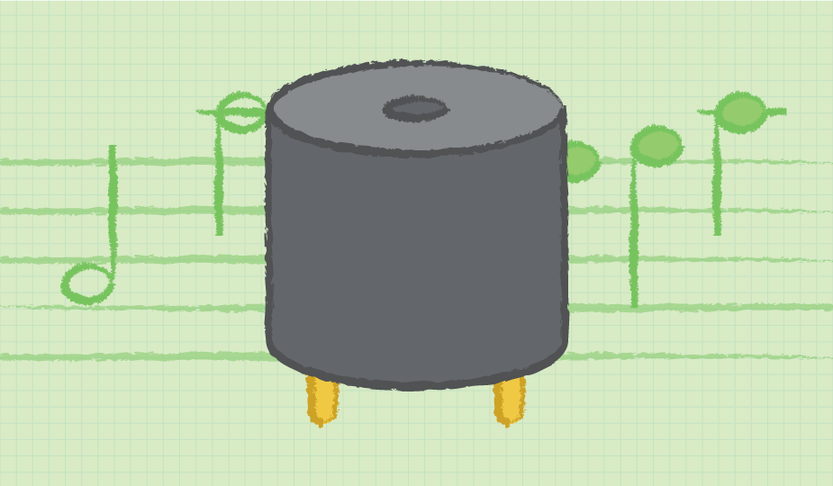

---

## Hardware - De Buzzer

- De buzzer is een piezo element dat een geluidstoon uitstuurt
- We kunnen dit sturen via
  - een digital signaal: aan of uit
  - een analoog signaal: dan genereren we een toon

*Wij werken voorlopig enkel met het digitale signaal.*

---

## Hardware - De Buzzer - Benodigdheden

- Arduino
- Grove Shield
- Buzzer Module


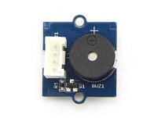

---

## Hardware - De Buzzer - Aansluiten

- Klik het shield voorzichtig op de Arduino
- Sluit de kabel aan op de `D4` connector
  - `D` = digitaal
- Zet de schakelaar op `5V`
- Sluit de BUZZEER module aan

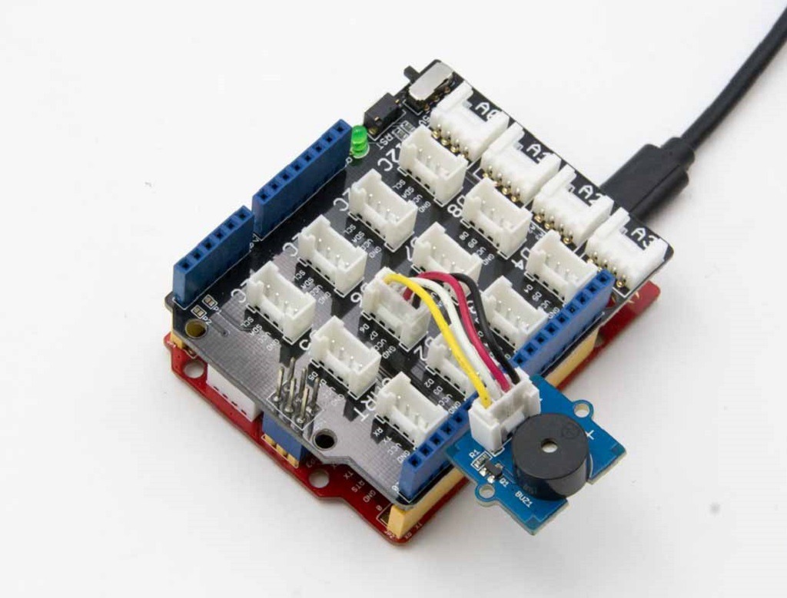

---

## Hardware - De Buzzer - Demo Sketch

- Ga naar `Bestand => Openen` en selecteer `05-buzzer`
- Druk op de pijl naar rechts ➡️ om te compileren en flashen

*Meer informatie vind je op [https://wiki.seeedstudio.com/Grove-Buzzer/](https://wiki.seeedstudio.com/Grove-Buzzer/)*

---

## Hardware - De Buzzer - Analyse

- `pinMode(4, OUTPUT);`
  - Hiermee stellen we pin `4` in als een digitale uitgang
    - Digitaal = `1` of `0`
      - `1` = `5V`
      - `0` = `0V`
    - Met een uitgang kunnen we iets aansturen
  - 1x dus doen we dit in `setup()`

---

## Hardware - De Buzzer - Analyse

- `digitalWrite(4, HIGH);`
  - Hiermee maken we pin `4` hoog
    - hoog = `1` of dus `5V`
    - de buzzer maakt geluid
- `digitalWrite(4, LOW);`
  - Hiermee maken we pin `4` laag
    - laag = `0` of dus `0V`
    - de buzzer maakt geen geluid

---


---

## Logica in Code - Een Alarm

- Kunnen we nu samen volgende applicatie maken?
  - Wanneer je de knop 3 seconden of langer indrukt moet het alarm aangaan.
  - Wanneer je de knop 1 seconde indrukt moet het alarm uitgaan.
- Wat kan ons allemaal helpen
  - Goed nadenken
  - Stap per stap uitwerken
  - Informatie sturen via `Serial.println()` naar de computer

---

## Logica in Code - Een Alarm - Opbouw

- We moeten bijhouden hoe lang er op de knopt wordt gedrukt
  - Dit kan via een variabel, bv. `secondenIngedrukt`
- Als de knop ingedrukt is, a.k.a. `HIGH`
  - Dan tellen we een seconde bij
- Als de knop is losgelaten, a.k.a. `LOW`
  - Dan moeten we kijken hoe lang deze eventueel was ingedrukt
    - 1 seconde: alarm uit
    - 3 seconden: alarm aan
  - Als laatste zetten we de teller terug op `0`

---


---

# Temperatuur sensor

- Een temperatuur sensor kan de omgevingstemperatuur opmeten
  - Veel verschillende soorten
    - Analoog / i2c / spi / 1-wire
    - Temperatuur / Luchtdruk / Luchtvochtigheid
    - Nauwkeurigheid
    - IC (chip), thermistor, ...
    - ...
  - Keuze hangt af van de toepassing

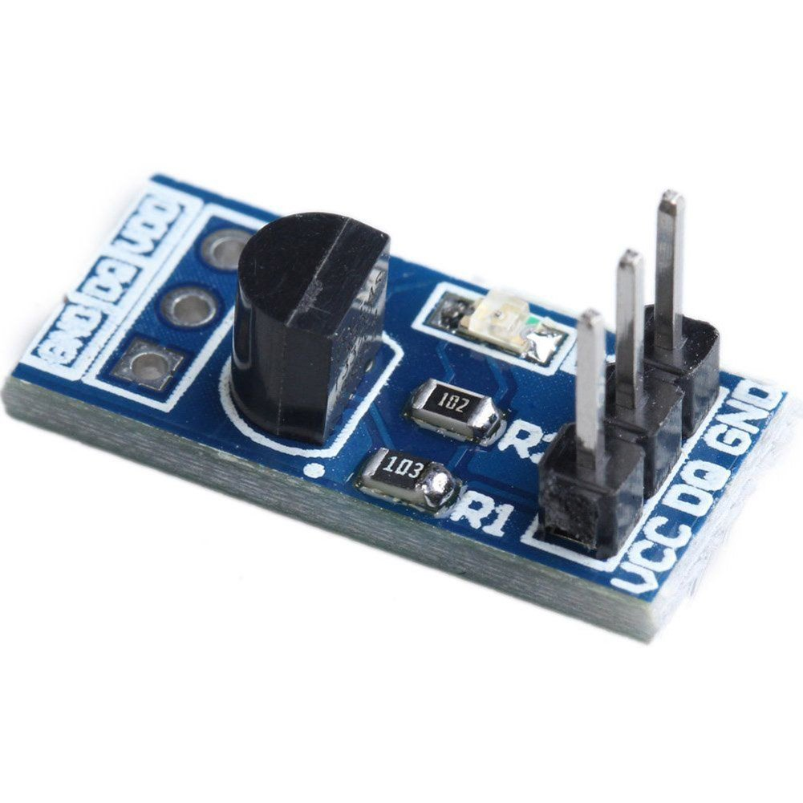
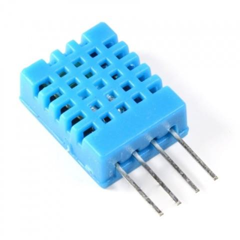
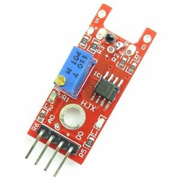

---

## Temperatuur sensor - Grove

- Grove voorziet een 10-tal verschillende temperatuur sensoren
- Wij gebruiken nu een simpele thermistor (temperatuursafhankelijke weerstand)
- Koppelen we aan een **analoge ingang**
  - Niet meer `1` of `0` (digitaal)
  - Maar waarde tussen `0` en `1023`
    - Stelt spanning voor tussen `0` en `5V` (of `3V3`)

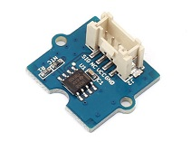

---

## Temperatuur sensor - Aansluiten

- Klik het shield voorzichtig op de Arduino
- Sluit de kabel aan op de `A0` connector
  - `A` = analoog
- Zet de schakelaar op `5V`
- Sluit de temperatuur sensor module aan

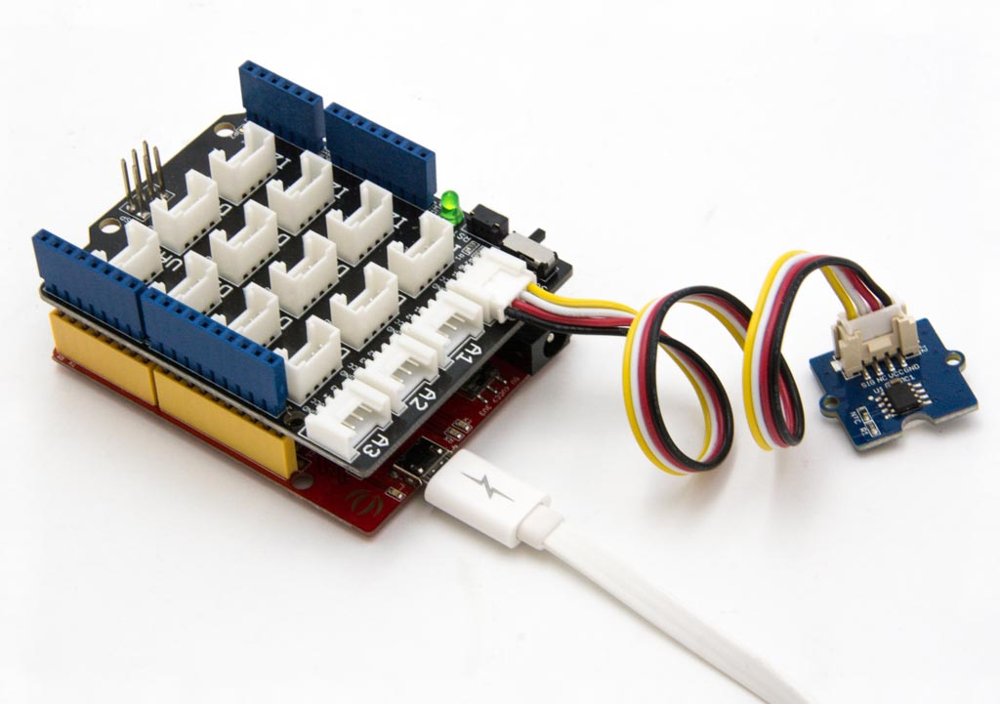

---

## Temperatuur sensor - Demo Sketch

- Ga naar `Bestand => Openen` en selecteer `06-temperature-sensor`
- Druk op de pijl naar rechts ➡️ om te compileren en flashen

*Meer informatie vind je op [https://wiki.seeedstudio.com/Grove-Temperature_Sensor_V1.2/](https://wiki.seeedstudio.com/Grove-Temperature_Sensor_V1.2/)*

---

## Temperatuur sensor - Analyse

- `pinMode(A0, INPUT);`
  - Hiermee stellen we pin `A0` in als een analoge ingang
    - Bij het inlezen krijgen we dan getal tussen 0 en 1023
  - 1x dus doen we dit in `setup()`

---

## Temperatuur sensor - Analyse

- `int voltage = analogRead(A0);`
  - Hiermee kunnen we de huidige "spanning" inlezen op de analoge pin

- De berekening is heel eigen aan temperatuur en deze sensor
- Dit haal je uit de datasheet of online
  - [https://www.youtube.com/watch?v=wjL7xOGqAqg&t=249s](https://www.youtube.com/watch?v=wjL7xOGqAqg&t=249s)

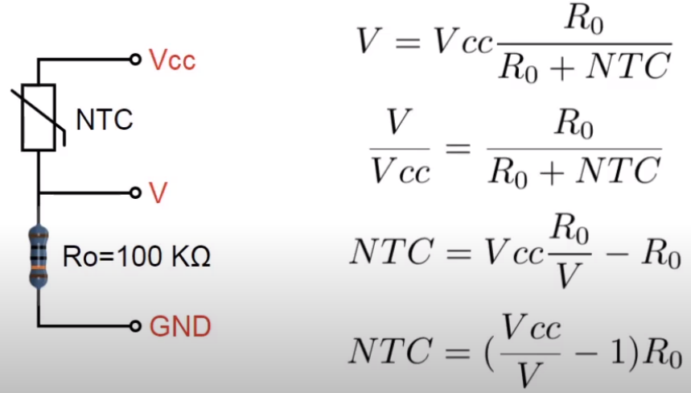


---

## Temperatuur sensor - Oefening

- Stuur een bericht naar de computer afhankelijk van de temperatuur.
  - Bv. `Temperatuur is ok` als deze lager is dan `25°C`
  - Bv. `Opgelet! Temperatuur is te warm` als deze hoger of gelijk is aan `25°C`.
  - Speel gerust zelf met de grenswaarde
  - Je kan de temperatuur verhogen door je vinger op het IC te leggen

---

## Temperatuur sensor - Oplossing

- We zullen hiervoor een `if-else` beslissing moeten implementeren.

```cpp
void loop() {
  // Temperatuur bepalen
  int voltage = analogRead(A0);
  double R = ((1023.0 / voltage) - 1.0 ) * R0;
  double temperatuur = (1.0 / ((log(R/R0)/B) + (1/298.15))) - 273.15;

  // Beslissen of temperatuur ok is of niet
  if (temperatuur < 25) {
    Serial.println("Temperatuur is ok");
  } else {
    Serial.println("Opgelet! Temperatuur is te warm");
  }

  delay(1000);
}
```

---

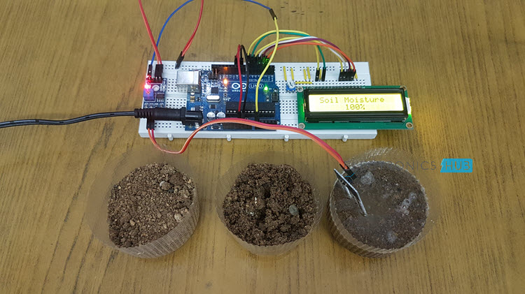

---

# Bodem vocht sensor

- Een bodem vocht sensor kan opmeten hoeveel vocht er in de grond zit
  - Er bestaan verschillende soorten
    - Resistief (goedkoop maar oxideert)
    - Capacitief (complexer maar oxideert niet)
    - ...
  - Keuze hangt af van de toepassing


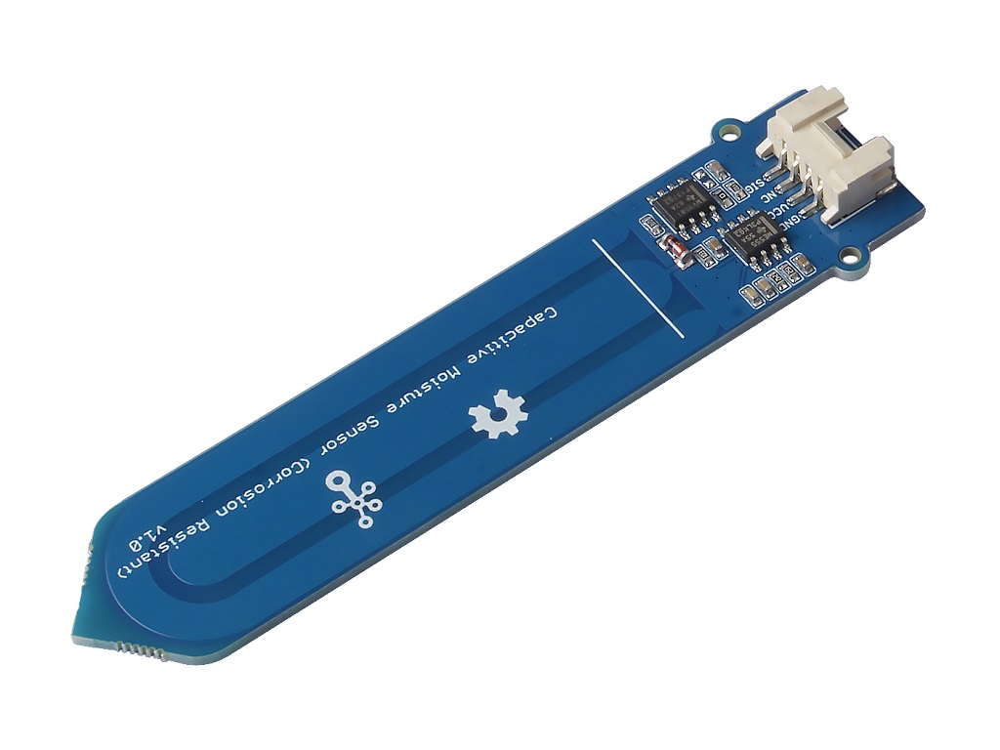

---

## Bodem vocht sensor - Grove

- Grove voorziet resistief en capacitieve bodem vocht sensoren
- Wij gebruiken nu een simpele resistieve sensor
- Koppelen we aan een **analoge ingang**
  - Niet meer `1` of `0` (digitaal)
  - Maar waarde tussen `0` en `1023`
    - Stelt spanning voor tussen `0` en `5V` (of `3V3`)


---

## Bodem vocht sensor - Aansluiten

- Klik het shield voorzichtig op de Arduino
- Sluit de kabel aan op de `A1` connector
  - `A` = analoog
- Zet de schakelaar op `5V`
- Sluit de bodem vocht sensor module aan

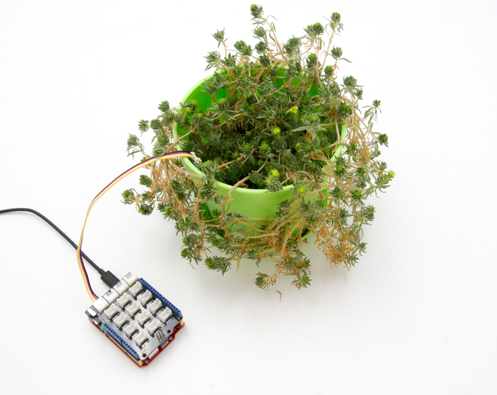

---

## Bodem vocht sensor - Demo Sketch

- Ga naar `Bestand => Openen` en selecteer `07-moisture-sensor`
- Druk op de pijl naar rechts ➡️ om te compileren en flashen

*Meer informatie vind je op [https://wiki.seeedstudio.com/Grove-Moisture_Sensor/](https://wiki.seeedstudio.com/Grove-Moisture_Sensor/)*

---

## Bodem vocht sensor - Analyse

- `pinMode(A1, INPUT);`
  - Hiermee stellen we pin `A1` in als een analoge ingang
    - Bij het inlezen krijgen we dan getal tussen 0 en 1023
  - 1x dus doen we dit in `setup()`

---

## Bodem vocht sensor - Analyse

- `int vochtgehalte = analogRead(A1);`
  - Hiermee kunnen we de huidige "spanning" inlezen op de analoge pin

- Is een ruwe waarde. Er bestaat niet echt een eenduidige omzetting naar % vocht.

---

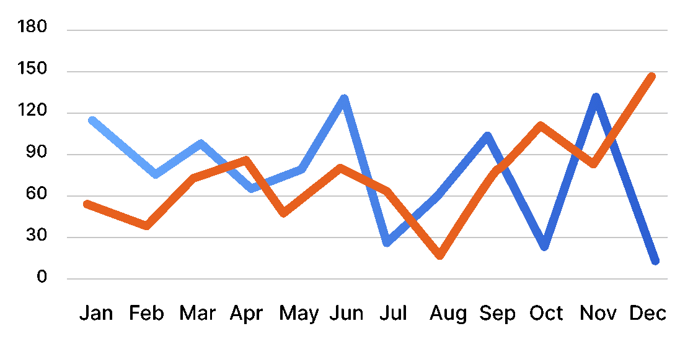

---

# Grafieken maken

- Via `Hulpmiddelen => Seriele Plotter` kan je grafieken maken
- De getallen mag je niet achter tekst plaatsen.
  - Dus waarde uitsturen via `Serial.println()`

---

# Grafieken maken - Grond vocht

- Dus bijvoorbeeld:

```cpp
void loop() {
  // Eerst moeten we de analoge spanning meten (getal tussen 0 en 1023)
  int vochtgehalte = analogRead(A1);

  Serial.println("Grondvocht: ");    // println !!
  Serial.println(vochtgehalte);

  delay(1000);
}
```

- Resultaat zie je via `Hulpmiddelen => Seriele Plotter`

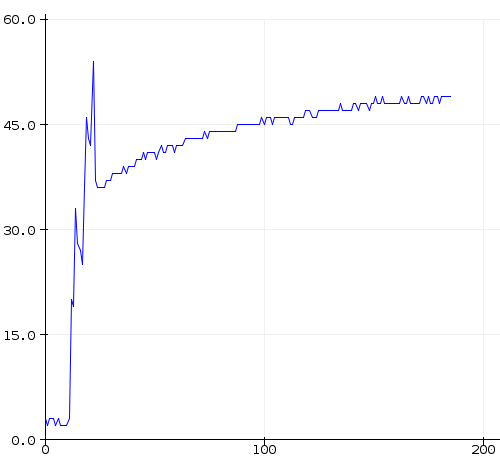

---


---

# Uitdaging - Planten Bewateren

- Planten monitoren
  - Grond vocht
  - Omgevingstemperatuur
- **Te nat?** Laat de rode LED branden
- **Te droog?** Laat het alarm afgaan
- **Ok?** Licht uit en alarm uit
- Zorg dat je zowel temperatuur als vocht in grafiek kan tonen
- Extra? In plaats van constant Alarm, kan je ook korte "tuut" geven?
- Extra moeilijk? Alarm uitzetten met druk op de knop

*Kies zelf maar wat te nat of te droog is. Experimenteer!*