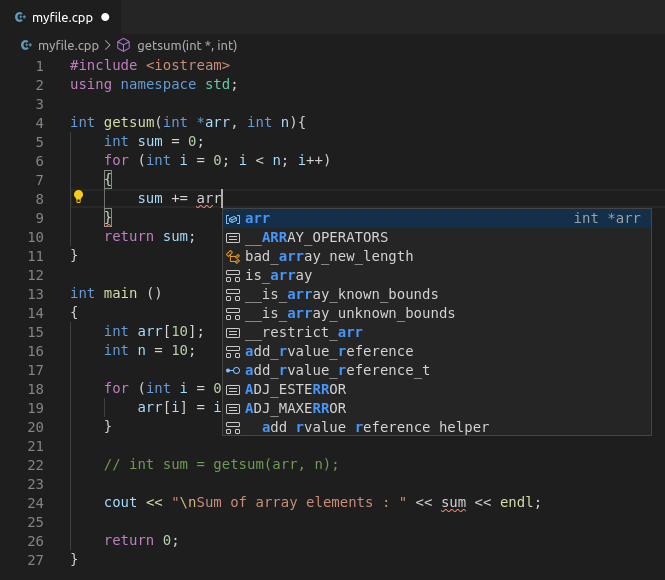

# Workshop Arduino Basics <!-- fit -->

---

# Wie zijn wij

TODO:

---

# Doel van vandaag

- Vandaag zijn we hier om iets bij te leren over
  - Arduino
  - Programmeren
  - Hardware (sensoren en actuatoren)

---

# Hoe pakken we dit aan?

- Heel praktisch
- Kleine stukjes theorie
- Veel zelf doen
- Experimenteren

---

# Wat is Arduino

TODO: Wat is Arduino ? Wat is Arduino IDE
TODO: Welke Arduino's bestaan er allemaal
TODO: Wat is nu eigenlijk een microcontroller?

---

# Wat is Programmeren

- Programmeren is instructies geven aan een computer
- Die verstaat echter onze taal niet
  - Verstaat enkel een obscure taal van 1'en en 0'en

---

## Programmeertaal

- Dit is echter veel te complex om mee te werken
- Vandaar dat we een programmeertaal gebruiken

---

## Compileren

- Wij schrijven dan een programma in die programmeertaal
- Dit wordt dan vertaald in computer instructies

---

## Programmeren met Arduino

- Arduino programmeren doen we met C++
- Heel populaire taal voor microcontrollers
- Niet de gemakkelijkste taal

---
